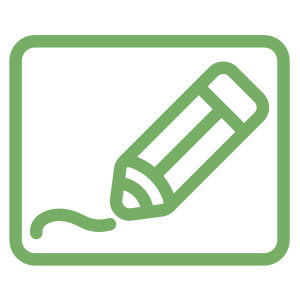

# modraw 



> "A collection of [tldraw](https://www.tldraw.com/) based anywidgets for marimo, but also other Python notebooks."

The project uses [anywidget](https://anywidget.dev/) under the hood so our tools should work in [Marimo](https://marimo.io/) but also [Jupyter](https://jupyter.org/), [Shiny for Python](https://shiny.posit.co/py/docs/jupyter-widgets.html), [VSCode](https://code.visualstudio.com/docs/datascience/jupyter-notebooks), [Colab](https://colab.google/), [Solara](https://solara.dev/) *and* [Marimo](https://marimo.io/). Because of the anywidget integration you should also be able interact with [ipywidgets](https://ipywidgets.readthedocs.io/en/stable/) natively. 

## Online demos 

Check [Github pages](https://koaning.github.io/modraw/) for a live demo. 

## Installation 

Installation occurs via `pip` or `uv`. 

```
python -m pip install modraw
uv pip install modraw
```

## Usage

### `Draw`

The main widget that's available in this library is the `Draw` widget. This generates a ltdraw widget and you're able to retreive the drawn image in a base64 representation or as a Python image object. 

```python
import marimo as mo
from modraw import Draw

widget = mo.ui.anywidget(Draw())
widget
```

```python
widget
```

## Development

I am currently exploring how we might move some of these components to react, mainly in an attempt to keep things flexible in the future. There's no need to port everything just yet but I have ported the clipboard button. You should be able to develop it via: 

```
make install
make dev
```

This assumes that you ran `npm install` beforehand. 